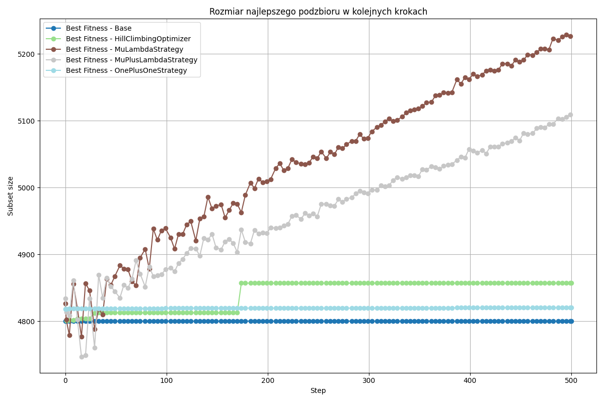
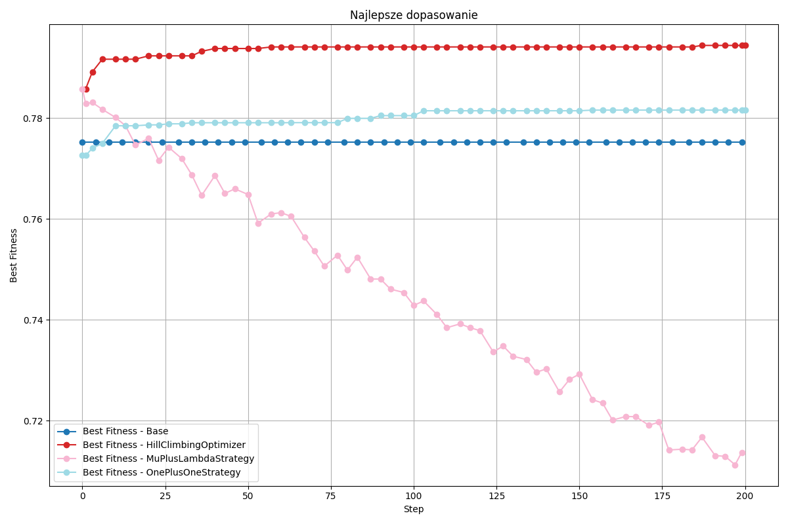
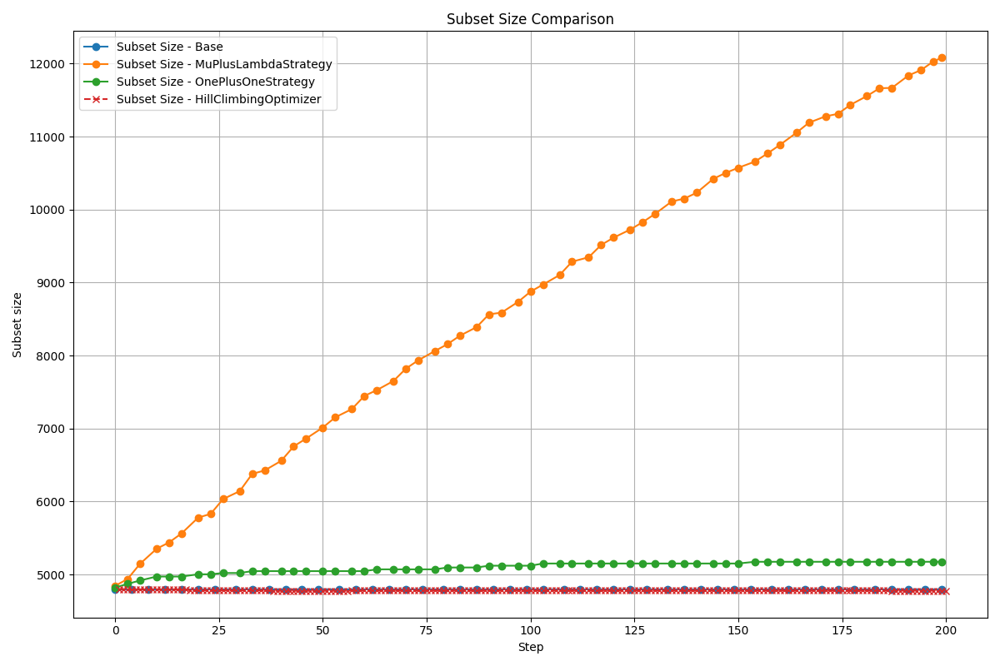

# Dokumentacja Końcowa

## Opis problemu
Dla problemu klasyfikacji obrazów (np. zbiór FashionMNIST lub docelowo CIFAR-10 lub CIFAR-100 ), należy znaleźć podzbiór najbardziej charakterystycznych przykładów z każdej klasy które są wystarczającym do zbudowania poprawnie działającego klasyfikatora. Czyli które zdjęcia są w stanie zapewnić najlepszą możliwą separację?

## Opis Rozwiązania

### Dane

W projekcie korzystamy z dwóch zbiorów danych: [FashionMNIST](https://pytorch.org/vision/0.19/generated/torchvision.datasets.FashionMNIST.html) oraz [CIFAR-10](https://pytorch.org/vision/main/generated/torchvision.datasets.CIFAR10.html).

Zbiory danych zostały już podzielone na część treningową i testową. W naszych eksperymentach wprowadziliśmy dodatkowy podział zbioru treningowego na część treningową i walidacyjną, aby przeprowadzić walidację podczas trenowania modelu. Część testowa z pierwotnego podziału została wykorzystana wyłącznie do ostatecznej oceny skuteczności modelu.

### Funkcja celu 
$$
J(S) = \alpha \cdot \text{Balanced Accuracy}(S) - \beta \cdot \frac{|S|}{|D|}
$$
$\alpha = 1.0$  
$\beta = 0.5$

### Zastosowane modele CV

Po przetestowaniu modeli jak radzą sobie z detekcją(2-3 epoki na calym zbiorze treningowym) na podstawie wyników wybraliśmy: 

- **Prosty Model własny** dla FashionMNIST:
```python

class SimpleCNN(nn.Module):

    def __init__(self):  
        super(SimpleCNN, self).__init__()  
        self.conv1 = nn.Conv2d(1, 16, kernel_size=3, padding=1)  
        self.conv2 = nn.Conv2d(16, 32, kernel_size=3, padding=1)  
        self.fc1 = nn.Linear(32 * 7 * 7, 128)  
        self.fc2 = nn.Linear(128, 10)  

    def forward(self, x):
        x = F.relu(self.conv1(x))
        x = F.max_pool2d(x, 2)
        x = F.relu(self.conv2(x))
        x = F.max_pool2d(x, 2)
        x = x.view(x.size(0), -1)
        x = F.relu(self.fc1(x))
        x = self.fc2(x)
        return x
```

- **Trójkanałowy prosty model własny** dla Cifar-10
```python
class CNN3Channel(nn.Module):  
    
    def __init__(self):  
        super(CNN3Channel, self).__init__()  
        self.conv1 = nn.Conv2d(3, 16, kernel_size=3, padding=1)  
        self.conv2 = nn.Conv2d(16, 32, kernel_size=3, padding=1)  
        self.conv3 = nn.Conv2d(32, 64, kernel_size=3, padding=1)  
        self.fc1 = nn.Linear(64 * 4 * 4, 128)  
        self.fc2 = nn.Linear(128, 10)  

    def forward(self, x):
        x = F.relu(self.conv1(x))
        x = F.max_pool2d(x, 2)
        x = F.relu(self.conv2(x))
        x = F.max_pool2d(x, 2)
        x = F.relu(self.conv3(x))
        x = F.max_pool2d(x, 2)
        x = x.view(x.size(0), -1)
        x = F.relu(self.fc1(x))
        x = self.fc2(x)
        return x
```

Decyzja o wyborze najprostszych modeli jest uzasadniona ich szybkością w trenowaniu oraz walidacji. Modele te osiągają wyniki na poziomie 85% na FashionMNIST i 50% na CIFAR-10 już po 2-3 epokach.

### Zastosowane algorytmy optymalizacyjne

Przetestowaliśmy 4 różne algorytmy optymalizacyjne:

- strategie ewolucyjną One Plus One

- strategie ewolucyjną Mu Plus Lambda

- strategie ewolucyjną Mu, Lambda

- algorytm wspinaczkowy

#### Parametery strategii ewolucyjnych 
- Krzyżowanie równomierne
- Mutacja zamiana bitów(1, 100)
- Selekcja ruletkowa

#### Paramtery algorytmu wspinaczkowego
- Sąsiedztwo określone jako maski(ktore obrazy wziąć) różniące sie o liczbę bitów (1, 10).


### Przeprowadzone eksperymenty

Przeprowadziliśmy eksperyemnty dla zbiorów danych FashionMNIST oraz CIFAR-10.

Każdy eksperyment powtórzyliśmy trzykrotnie, aby uśrednić wyniki oraz zminimalizować wpływ losowości algorytmów na potencjalne wartości skrajne.

W obu przypadkach zaczęliśmy od wyznaczenia bazowej wartości metryk dla losowego osobnika który był określany w taki sam sposób jak początkowy osobnik w algorymtach optymalizacyjnych. Wartość tych metryk także została uśredniona dla kilku osobników.

## Obserwacje
W poniższej analizie TEST LOSS oznacza wynik naszej metryki z punktu [Funkcja celu](#funkcja-celu).

Wyniki TEST LOSS i BALANCED ACCURACY są wynikami na zbiorze testowym po wytrenowaniu modelu przez 5 epok na podzbiorze treningowym wyznaczonym przez algorytmy optymalizacyjne.

Na początku wyznaczyliśmy rozmiar początkowego osobnika oraz liczbę epok treningowych, które zapewniają odpowiedni balans między szybkością trenowania a wynikiem balanced accuracy. Eksperyment został przeprowadzony dla FashionMNIST oraz CIFAR-10 Ich przebieg znajduję się w notebookach:

- notebooks/01-MO-FashionMnist_initial_ind_size.ipynb.

- notebooks/03-MO-Cifar_initial_indyvidual.ipynb

### Analiza wyników FashionMNIST

**Ekspertymenty z mutacją równą jeden**

**Wartości metryk**

| Metric             | TEST LOSS | BALANCED ACCURACY |
| ------------------  | --------- | ----------------- |
| Bazowe rozwiązanie  | 0.778     | 0.828             |
| Mu+Lambda           | 0.793     | 0.846             |
| Mu, Lambda          | 0.790     | 0.845             |
| One plus one        | 0.800     | 0.851             |
| Wspinaczkowy        | 0.793     | 0.847             | 




Z zebranych wyników możemy zauważyć, że udało nam się znaleść lepsze wyniki niż losowe oraz początkowe, ale nie jest to bardzo duża różnica. 

Wyniki pomiędzy różnymi technikami optymalizacji nie różnią się znacząco między sobą w osiągnięciu ostatecznego wyniku. 

Na podstawie wykresu: `Figure 2: Rozmiar podzbioru` możemy zauważyć, że w przypadku `algorytmu wspinaczkowego` oraz `strategii one plus one` rozmiar pozostaje stabliny. Jednak dla `Mu, lambda` oraz `Mu plus lambda` rozmiar rośnie przez co wartość funkcji celu powoli spada co możemy zaobserwować na wykresie: `Figure 1: Najlepsze dopasowanie`.

**Eksperymenty ze zwiększonym sąsiedztwem oraz mutacją**

**Wartości metryk**

| Metric             | TEST LOSS | BALANCED ACCURACY |
| ------------------  | --------- | ----------------- |
| Bazowe rozwiązanie  | 0.778     | 0.828             |
| Mu+Lambda           | 0.793     | 0.846             |
| One plus one        | 0.790     | 0.845             |
| Wspinaczkowy        | 0.801     | 0.851             |





W przypadku zastosowania większej mutacji w strategiach oraz większej różnicy bitów między sąsiadami w algorytmie wspinaczkowym.
Nie widać polepszenia się wyników względem poprzednich eksperymentów. 

Dalej nasze algorymty otrzymują końcową wartość lepszą niż punkty bazowe, ale nie widać poprawy wzlędem eksperymentów przeprowadzonych z mnieszją mutacją. 

Główną różnicę jaką możemy zauważyć jest jeszcze większe odbieganie w przypadku `strategii mu plus lambda` od początkowego zbioru i jego szybsze zwiększanie co powoduje szybszy spadek wartości funkcji celu.

### Analiza wyników Cifar-10


Wyniki na zbiorze testowym po wytrenowaniu na podzbiorze treningowym. 

|                   |    TEST LOSS       | BALANCED ACCURACY |
| ----------------- | ------------------ | ----------------- | 
| Bazowe rozwiązanie| 0.410              | 0.460             | 
| Mu+Lambda         | 0.445              | 0.498             |
| Wspinaczkowy      | 0.447              | 0.502             | 

Z tabeli wynika że optymalizatory poprawiją wyniki względem bazowego rozwiązania, ale nie różnią się znacząco między sobą.


  


Wykres "Figure 5: Najlepsze dopasowanie" pokazuje zmianę wartości funkcji loss na przestrzeni kolejnych kroków. Można zauważyć, że ze względu na selekcję ruletkową, Mu+Lambda zmienia wynik raz w jedną, raz w drugą stronę, ale oscyluje wokół tego samego poziomu. Algorytm wspinaczkowy rośnie przez pierwsze 100 kroków, a później się stabilizuje. Oba algorytmy osiągają lepsze wyniki niż rozwiązanie bazowe.

W tabeli "Figure 6: Rozmiar podzbioru" możemy zauważyć, że rozmiar podzbiorów w obu algorytmach stabilnie rośnie. Z połączenia tych dwóch obserwacji możemy wysnuć wniosek, że algorytmy optymalizacyjne znajdują coraz lepszy podzbiór treningowy. Jednak funkcja celu, która karze za zbyt duży rozmiar, powoduje, że na wykresie "Najlepsze dopasowanie" wyniki się nie polepszają. Polepsza się jednak zdolność modelu wyuczonego na wyznaczonym przez algorytmy podzbiorze. Zgadza się to również z wynikami z tabeli z wynikami algorytmów.

## Podsumowanie 

Możemy zauważyć ogólny trwały trend z delikatnymi fluktuacjami przy strategiach Mu+Lambda i Mu,Lambda (spowodowane selekcją ruletkową). W przypadku algorytmu wspinaczkowego i strategii One Plus One widzimy poprawę na samym początku. Nie oznacza to jednak, że eksperymenty do niczego nie prowadzą. Algorytmy odnajdują coraz lepsze podzbiory treningowe, co możemy zauważyć w tabelach opisujących wyniki na ostatecznym zbiorze testowym. Ogólnie rzecz biorąc, z eksperymentów wynika, że udało nam się znaleźć lepsze podzbiory do trenowania, lecz nie jest to spektakularna różnica.

W przypadku obu zbiorów danych wyniki są podobne. Różnice w pułapie wartości wynikają z tego, że nasz prosty model 3ChannelCNN jest na tyle małym modelem, że nie jest w stanie nauczyć się klasyfikować zbioru CIFAR-10 na wyższym poziomie. SimpleCNN radzi sobie lepiej na zbiorze FashionMNIST. Zdecydowaliśmy się jednak pozostać przy 3ChannelCNN ze względu na jego szybkość względem innych popularnych architektur.

Warto zauważyć, że najprostsze metody, czyli OnePlusOne i algorytm wspinaczkowy, dały najlepsze rezultaty.

## Zespół
Mateusz Ostaszewski 325203  
Michał Sadowski 325221
